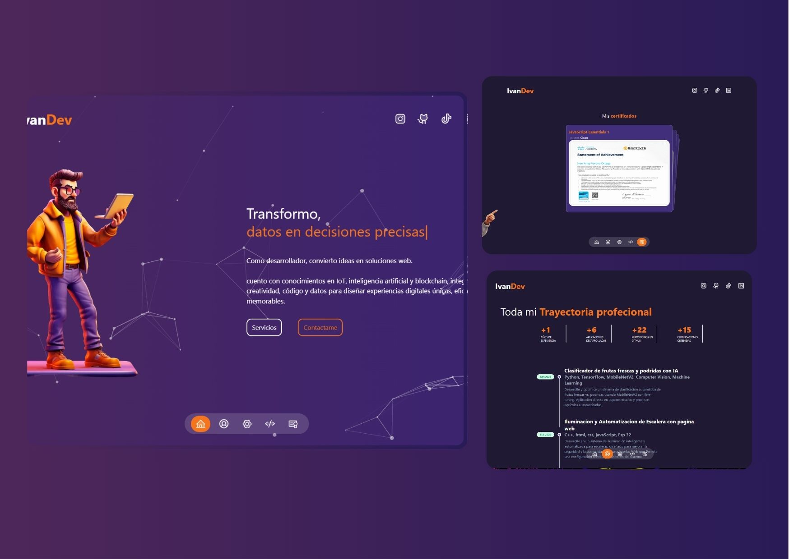

# 🌐 Portafolio Personal - Next.js

Este es el **landing page de portafolio** desarrollado con [Next.js](https://nextjs.org/) y [Tailwind CSS](https://tailwindcss.com/), diseñado para mostrar mis proyectos, habilidades y experiencia de forma moderna, minimalista y optimizada para dispositivos móviles.

## 📦 1.Instalación 

```bash
# Instalacion
npm install

npx create-next-app@latest my-project --typescript --eslint 
cd my-project
```
## 📦 2.Instalación de complementos

```bash
 npm install @tsparticles/react

 npm i react-countup

 npm install react-type-animation

 npm install swiper

 npm install motion

 npm install swiper
 
 npm install react-icons --save

```

## 📦 3. Ejecutar en modo desarrollo

```bash
npm run dev
```

## 📸 Vista previa

> 💡 Si quieres ver el sitio en vivo, visita: **[https://ivanvarona.netlify.app/](https://ivanvarona.netlify.app/)**
First, run the development server:


## 🚀 Tecnologías utilizadas

- **[Next.js 15.4.6](https://nextjs.org/)** – Framework de React con renderizado híbrido (SSR/SSG).
- **[react-countup](https://www.npmjs.com/package/react-countup)** – Componente de React para mostrar contadores animados con incrementos numéricos suaves.
- **[react-type-animation](https://www.npmjs.com/package/react-type-animation)** – Componente de React para crear animaciones de texto que simulan escritura y borrado.
- **[@tsparticles/react](https://motion.dev/docs/react)** – Librería para generar y personalizar partículas animadas en fondos interactivos dentro de aplicaciones React.
- **[Swiper.js](https://swiperjs.com/)** – Librería de carruseles y sliders con soporte para gestos táctiles, animaciones y navegación responsiva.
- **[Motion](https://motion.dev/docs/react)** – Librería de animaciones para React con sintaxis declarativa y alto rendimiento.
- **[tailwindcss](https://tailwindcss.com/docs/installation/framework-guides/nextjs)** – Framework de CSS basado en utilidades para construir interfaces personalizadas de forma rápida y responsive.
- **[Lucide React](https://lucide.dev/guide/packages/lucide-react)** – Conjunto de iconos SVG optimizados para React, personalizables.

## 🖼️ Captura final


---

💻 **Idea tomada de TarreDev** (https://www.youtube.com/@tarredev) 
